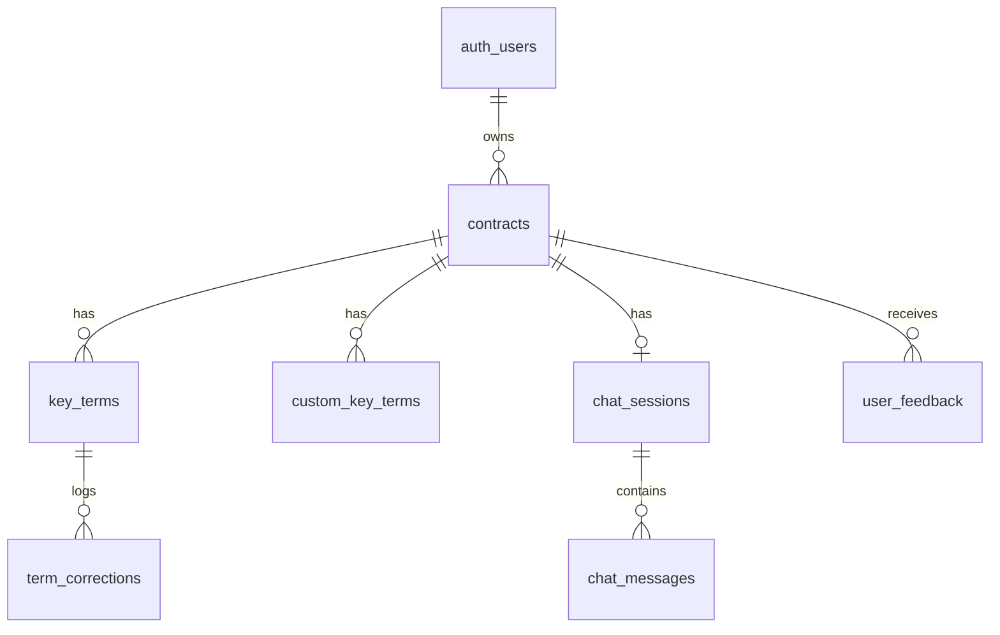

# ContractIQ — Engineering Document

**Status:** Draft — Stage 1 Output
**Source:** `docs/ContractIQ_PRD.md` (v1.0, June 24 2026)
**Owner:** Engineering
**Last updated:** 2026-07-25

This document is the authoritative technical reference for ContractIQ. No implementation begins until this document and `implementation-specs.md` are approved. All downstream stages (`docs/specs/`, security foundation, frontend scaffold, feature implementation) depend on the decisions recorded here.

> **Architectural decisions locked in for this document** (resolved with product owner before drafting):
> - **Backend:** Next.js API Routes (Route Handlers) — not standalone Supabase Edge Functions.
> - **LLM provider:** OpenAI GPT-4o, per the PRD's explicit model requirements, prompt strategy, and cost model. (Note: `README.md` currently states "Anthropic Claude API" — this is stale and should be corrected to avoid confusion in future stages.)
> - **User roles:** Single `authenticated user` role for MVP. No admin/team roles — multi-user workspaces are explicitly v1.2 (post-MVP) per the PRD roadmap.
> - **PDF viewer fallback:** The text-viewer fallback (FR-06) is a first-class component with full page-navigation and highlight parity with the PDF.js viewer, not a degraded stub.

---

## 1. Executive Summary

**Project name:** ContractIQ

**Business goal:** Give SMBs and freelancers without in-house legal counsel a fast, trustworthy way to understand NDA and MSA contracts before signing — reducing review time from 90–120 minutes to ≤15 minutes without requiring legal training.

**Problem statement:** Business professionals routinely sign NDAs and MSAs without fully understanding the terms. Manual review is slow, expensive ($250–$500/hr legal rates), and error-prone. Generic AI tools (ChatGPT) give unstructured summaries with no page attribution, no confidence scoring, and no auditability. Rule-based parsers fail on clause variant diversity (>30% miss rate).

**Target users:**
- **Primary:** Time-pressed founder / ops lead / procurement manager at a 5–250 person company with no in-house legal counsel, signing 5–15 NDAs/MSAs per month.
- **Secondary:** Freelancer/consultant receiving 1–4 MSAs per month from clients, unable to afford legal review.

**Success criteria (from PRD §3):**

| Metric | Target |
|---|---|
| Time from upload to completed key-term review (North Star) | ≤ 15 minutes |
| Key-term extraction F1 | ≥ 88% (NDA), ≥ 85% (MSA) |
| Confidence calibration error | ≤ 0.10 per 10%-bucket |
| Time to first extracted key-term display | ≤ 30s P95 (≤20-page contracts) |
| Chat response latency | ≤ 15s P95 |
| Cost per contract analysis | ≤ $0.25 (target $0.20 extraction-only) |
| 30-day retention | ≥ 45% |
| AI correction rate | ≤ 12% of terms |

**What "done" means for this document:** every functional requirement (FR-01–FR-14) and P0/P1 user story (US-001–US-012) in the PRD is traceable to a concrete architectural decision below, and Stage 2 (`/implementation-specs`) can generate runnable specs and SQL directly from this document without further product clarification.

---

## 2. Product Scope

### In Scope (MVP — through v1.0, PRD roadmap weeks 1–14)

- Email/password authentication (Supabase Auth)
- PDF upload (≤10MB, ≤20 pages, ≤15,000 tokens), text-layer only
- Text extraction with `[PAGE N]` markers, stored once at upload
- Contract type selection (NDA or MSA)
- Standard key-term extraction via GPT-4o (10–12 terms per type)
- Up to 5 custom key terms per analysis
- Confidence scoring (0–100%) per term with colour-coded warnings
- Page-number attribution + source-sentence ("Why?") per term
- Two-panel results view: PDF viewer (or text-viewer fallback) + key terms panel
- Click-to-navigate from key term to page
- Inline term correction with "Edited" badge and original-value retention
- Contract chat (Q&A) grounded in full contract text, with mandatory page citation
- Persistent chat history per contract
- Dashboard with contract history (sortable), summary counts by type
- Thumbs up/down feedback with optional comment (P2, v1.0)
- "Not legal advice" disclaimer on every results page
- RLS-enforced multi-tenant data isolation
- Rate limiting, retry-with-backoff on OpenAI failures

### Out of Scope (MVP)

- Scanned/image PDFs (OCR) — v1.2
- Non-English contracts / non-US/UK legal conventions — post-12-months
- Contract types other than NDA/MSA
- Multi-user workspaces / team seats / roles beyond single owner — v1.2
- Contract comparison (side-by-side) — v1.2
- Export to CSV/PDF — v1.1
- Batch upload — v1.1
- Email notifications — v1.2
- Chunked/vector RAG (full-context only while contracts ≤15k tokens)
- Native desktop app

### Future Enhancements (Post-MVP, from PRD roadmap)

| Release | Key additions |
|---|---|
| v1.1 | CSV/PDF export, batch upload (≤5), dashboard analytics charts |
| v1.2 | OCR for scanned PDFs, contract comparison view, email notifications, multi-user workspaces |

---

## 3. User Personas

MVP ships with a **single role: `authenticated user`**. There is no admin, reviewer, or team role in the data model or authorization logic at this stage — this keeps RLS policies simple (`user_id = auth.uid()` everywhere) and matches the PRD's single-owner-per-contract model.

| Persona | Responsibilities in-app | Permissions |
|---|---|---|
| **Founder / Ops Lead** (primary) | Uploads contracts, reviews extracted terms, corrects inaccuracies, chats with contract, manages own dashboard | Full CRUD on own `contracts`, `key_terms`, `chat_sessions`, `chat_messages`, `user_feedback` rows. Zero visibility into other users' data (enforced via RLS) |
| **Freelancer / Consultant** (secondary) | Same workflow as primary persona, lighter usage (1–4/month) | Identical permission set — no persona-based feature gating at MVP |

Primary workflow for both personas: **Sign up → Upload contract → Review extracted terms → (optionally) chat → (optionally) correct terms → Return via dashboard for history.**

Team/role expansion (v1.2) is explicitly deferred; the schema in §7 does not include a `workspace_id` or `role` column, so this must be added as a migration when v1.2 is scoped — not retrofitted silently now.

---

## 4. User Flows

Format: `User Action → Frontend Behavior → Backend Processing → Database Interaction → System Response`

### Flow 1 — Sign Up

```
User clicks "Get Started Free" on landing page
→ Frontend opens Supabase Auth sign-up modal (email + password), client-side validation (email format, password length ≥ 8)
→ Backend: Supabase Auth handles user creation directly (no custom API route) — supabase-js client calls auth.signUp()
→ DB: row inserted into auth.users (managed by Supabase); trigger creates a corresponding profile row if needed (see §7)
→ System redirects to /dashboard on success; on failure, inline error ("Email already registered", "Password too weak")
```

### Flow 2 — Sign In (Returning User)

```
User submits email + password on /login
→ Frontend calls supabase.auth.signInWithPassword(), stores session token client-side
→ Backend: none (Supabase Auth handles verification)
→ DB: Supabase validates against auth.users
→ System redirects to /dashboard; dashboard queries contracts table for summary + last 5 contracts, scoped to auth.uid()
```

### Flow 3 — Core Flow: Contract Review (Upload → Extraction → Results)

```
1. User clicks "Review Contract" → selects contract type (NDA/MSA) → uploads PDF
   → Frontend: client-side validation (file type, ≤10MB); shows drag-and-drop zone
   → Backend: POST /api/contracts/upload receives multipart file
     - Uploads PDF to Supabase Storage (contracts/{user_id}/{contract_id}/{filename}.pdf) — non-blocking; failure only disables PDF viewer later
     - Runs pdf-parse to extract text, inserting [PAGE N] markers per page boundary
     - If extracted text < 100 words → reject with "Scanned PDFs are not supported yet"
     - If token count > 15,000 → reject with clear message
   → DB: INSERT into contracts (status='uploaded', contract_text, page_count, contract_type, file_path)
   → System: returns contract_id; frontend shows pre-processing preview of standard key terms for the selected type

2. User optionally adds up to 5 custom key terms (+ Add Key Term)
   → Frontend: appends to local state list, "Custom" badge shown
   → Backend: none yet (persisted at process time)
   → DB: none yet
   → System: preview list updates in real time

3. User clicks "Process Contract"
   → Frontend: shows 3-step progress indicator (extracting text ✓ already done → analysing with AI → compiling results)
   → Backend: POST /api/contracts/{id}/process
     - INSERT custom terms into custom_key_terms (is_manual=true)
     - Builds few-shot extraction prompt (contract_text + standard term schema for type + custom terms)
     - Calls OpenAI GPT-4o with response_format=json_object, temperature=0.1
     - Validates JSON; on parse failure, sends one retry prompt ("return only the JSON array")
     - On success, parses [{term_name, value, page_number, confidence_score, source_sentence}]
   → DB: UPDATE contracts SET status='processing' then 'completed'; bulk INSERT into key_terms
   → System: redirects to /contracts/{id}/results

4. Results page renders
   → Frontend: two-panel layout — left: PDF.js viewer (signed URL, 1hr expiry) or text-viewer fallback if Storage/signed URL unavailable; right: key terms panel (term, value, page, confidence, colour-coded)
   → Backend: GET /api/contracts/{id} (terms + signed URL) — RLS-scoped
   → DB: SELECT from contracts + key_terms + custom_key_terms WHERE user_id = auth.uid()
   → System: terms with confidence < 50% show ⚠️ + tooltip; clicking a term's page number scrolls/highlights the corresponding viewer page (both PDF and text viewer implement the same targetPage contract)

5. User edits a term inline
   → Frontend: click-to-edit on term value field
   → Backend: PATCH /api/key-terms/{id} { value }
   → DB: UPDATE key_terms SET value=..., is_edited=true, original_ai_value=<preserved> (only set once); INSERT term_corrections row for feedback loop
   → System: "Edited" badge appears; save confirmed within 2s
```

### Flow 4 — Chat with Contract

```
User clicks "Chat" tab/floating button on results page
→ Frontend: opens chat panel; loads prior messages for this contract's chat_session (if any)
→ Backend: POST /api/contracts/{id}/chat { message }
  - Fetches contracts.contract_text (already stored — no re-download of PDF)
  - Fetches up to 200 prior messages for the session (ascending) for conversation memory
  - Runs lightweight query classification (contract / history / both) to adjust system prompt inclusion, no extra API call
  - Calls GPT-4o (temperature 0.4, max 1000 output tokens) with system prompt: "Answer only from the document text provided. If the answer is not in the document, say so." + mandatory [Page X] citation instruction
→ DB: INSERT user message + assistant message into chat_messages (linked to chat_sessions → contracts); creates chat_sessions row on first message if none exists
→ System: response streamed/rendered in chat UI (assistant left-aligned, "Based on the document…" prefix, page citation link that scrolls the viewer)
```

### Flow 5 — Dashboard / History

```
User navigates to /dashboard
→ Frontend: requests summary + sortable contract list
→ Backend: GET /api/dashboard (or direct Supabase client query — no OpenAI involvement, so no custom API route needed; frontend queries Supabase directly per PRD's architecture note that only OpenAI-heavy ops go through the backend)
→ DB: SELECT count(*), count(*) by contract_type, and last N contracts FROM contracts WHERE user_id = auth.uid() ORDER BY sortable column
→ System: renders summary card + sortable table; clicking a row opens /contracts/{id}/results
```

### Flow 6 — Feedback Submission (P2)

```
User clicks thumbs up/down on results page, optionally adds comment
→ Frontend: inline widget, no page navigation
→ Backend: POST /api/feedback { contract_id, rating, comment }
→ DB: INSERT into user_feedback (user_id, contract_id, rating, comment, created_at)
→ System: confirmation toast; no further action
```

---

## 5. Frontend Architecture

**Stack:** Next.js 14 (App Router), React 18, Tailwind CSS, TypeScript.

**State management:**
- **Server state:** React Query (`@tanstack/react-query`) for all data fetched from API routes / Supabase (contracts, key terms, chat messages, dashboard summary) — handles caching, revalidation after mutations (term edits, new chat messages).
- **Client/UI state:** React `useState`/`useReducer` for local, ephemeral state (upload progress, custom-term draft list before processing, active chat input, PDF viewer zoom/page).
- **Auth state:** Supabase Auth session via `@supabase/ssr` helpers, propagated through a root layout provider; middleware (`middleware.ts`) protects `/dashboard` and `/contracts/*` routes.

**Routing strategy (App Router):**

```
/                          → Landing page (marketing, static)
/login, /signup            → Auth pages
/dashboard                 → Contract history + summary
/contracts/new             → Upload + type selection + custom terms + processing
/contracts/[id]/results    → Two-panel results (viewer + key terms + chat)
```

**UX states required for every data-driven view:**
- **Loading:** skeleton loaders for key terms panel and dashboard table; 3-step progress indicator during processing (extract → analyse → compile)
- **Empty:** dashboard empty state ("No contracts reviewed yet — upload your first contract to begin")
- **Error:** upload rejection (file too large/too many pages/scanned PDF/token limit), OpenAI timeout/failure with "Try again in a few minutes" CTA, Storage-unavailable banner (viewer falls back to text mode, non-blocking)
- **Responsive:** results page collapses to stacked (viewer above key terms) below `md` breakpoint; PDF.js viewer lazy-loads pages to control memory on mobile
- **Accessibility (WCAG 2.1 AA):** all interactive elements keyboard-navigable, visible focus states, legal jargon terms wrapped in `<Tooltip>` with plain-English explanations, colour-coded confidence scores paired with icon + text (not colour alone)

**Component hierarchy (key branches):**

```
app/
├── layout.tsx                          # Root layout, Supabase session provider, React Query provider
├── page.tsx                            # Landing page
├── (auth)/login/page.tsx
├── (auth)/signup/page.tsx
├── dashboard/
│   ├── page.tsx
│   └── components/
│       ├── SummaryCard.tsx
│       └── ContractHistoryTable.tsx
├── contracts/
│   ├── new/
│   │   ├── page.tsx
│   │   └── components/
│   │       ├── ContractTypeSelector.tsx
│   │       ├── UploadDropzone.tsx
│   │       ├── KeyTermPreviewList.tsx
│   │       ├── CustomTermInput.tsx
│   │       └── ProcessingProgress.tsx
│   └── [id]/results/
│       ├── page.tsx
│       └── components/
│           ├── ContractViewerPanel.tsx      # switches between PdfViewer and TextViewer
│           ├── PdfViewer.tsx                # PDF.js, signed URL, targetPage prop
│           ├── TextViewer.tsx               # parses [PAGE N] markers, same targetPage contract
│           ├── KeyTermsPanel.tsx
│           ├── KeyTermRow.tsx               # value, page link, confidence badge, "Why?" expandable, inline edit
│           ├── ChatPanel.tsx
│           ├── ChatMessage.tsx
│           └── FeedbackWidget.tsx
└── api/                                 # Route Handlers — see §6/§9
```

Shared/cross-cutting components (`components/ui/`): `Button`, `Badge`, `Tooltip`, `ConfidenceIndicator`, `Disclaimer` ("not legal advice", rendered on every results page).

---

## 6. Backend Architecture

**Stack:** Next.js 14 API Routes (Route Handlers under `app/api/`), deployed as Vercel serverless/edge functions. No separate Supabase Edge Functions layer — this keeps a single deployable unit and a single runtime (Node.js) for all OpenAI-heavy orchestration, per the architectural decision at the top of this document.

**Design principle (from PRD):** the backend layer is kept thin — orchestration only, no business logic beyond request validation, prompt construction, OpenAI invocation, and Supabase writes. Reads that don't touch OpenAI (dashboard, contract list) go directly from the frontend to Supabase via the client SDK, scoped by RLS — no API route needed.

**Core systems:**

| System | Implementation |
|---|---|
| **Auth** | Supabase Auth (email/password). Session cookie set via `@supabase/ssr`; every API route validates the session server-side (`createServerClient`) before processing — no custom JWT layer |
| **Authorization** | Row-Level Security on every table (`user_id = auth.uid()`). API routes additionally re-check `contract.user_id === session.user.id` before any OpenAI call, as defense-in-depth against RLS misconfiguration |
| **Business logic** | PDF text extraction (`lib/pdf/extractText.ts`), prompt construction (`lib/openai/prompts/`), extraction/chat orchestration (`lib/openai/client.ts`), confidence/threshold logic (`lib/terms/confidence.ts`) |
| **Validation** | Request schema validation via `zod` on every route (file size/type, contract_type enum, message length, term_name length ≤ 5 custom terms) |
| **Middleware** | `middleware.ts` — redirects unauthenticated users away from `/dashboard`, `/contracts/*`; rate-limiting middleware on `/api/contracts/*/process` and `/api/contracts/*/chat` (see §8) |
| **Error handling** | Centralized error responses (`lib/api/errors.ts`) — every OpenAI/Supabase failure caught, logged, and surfaced as a structured `{ error: { code, message } }` JSON response; no silent failures per PRD reliability constraint. Contract `status` set to `'error'` so the user can retry without re-uploading |

**Service interaction diagram:**

```mermaid
sequenceDiagram
    participant FE as Frontend (Next.js)
    participant API as API Routes (Next.js)
    participant SB as Supabase (Auth/DB/Storage)
    participant AI as OpenAI GPT-4o

    FE->>SB: Auth (sign up/in), direct reads (dashboard, contract list)
    FE->>API: POST /api/contracts/upload (PDF)
    API->>SB: Upload PDF to Storage (non-blocking)
    API->>API: pdf-parse → text + [PAGE N] markers
    API->>SB: INSERT contracts(contract_text, status)
    API-->>FE: contract_id

    FE->>API: POST /api/contracts/{id}/process
    API->>SB: SELECT contract_text; INSERT custom_key_terms
    API->>AI: Extraction prompt (JSON mode, temp 0.1)
    AI-->>API: JSON key terms
    API->>SB: INSERT key_terms; UPDATE contracts.status='completed'
    API-->>FE: results ready

    FE->>API: POST /api/contracts/{id}/chat
    API->>SB: SELECT contract_text + chat_messages history
    API->>AI: Chat prompt (full context, temp 0.4)
    AI-->>API: Grounded answer + [Page X]
    API->>SB: INSERT chat_messages (user + assistant)
    API-->>FE: chat response
```

---

## 7. Database Design and Schema

Single Supabase (Postgres) project. Every table has a `user_id` foreign key to `auth.users` and RLS enabled — a user can only read/write their own rows. Storage bucket `contracts` uses path-based RLS (`contracts/{user_id}/{contract_id}/{filename}.pdf`).

### `contracts`

| Column | Type | Notes |
|---|---|---|
| `id` | `uuid` PK, default `gen_random_uuid()` | |
| `user_id` | `uuid` FK → `auth.users(id)` | not null, indexed |
| `contract_type` | `text` | `'NDA'` \| `'MSA'`, not null |
| `file_name` | `text` | original filename |
| `file_path` | `text` | Storage path; nullable (upload is non-blocking — null if Storage failed) |
| `contract_text` | `text` | extracted text with `[PAGE N]` markers; single source of truth for extraction + chat |
| `page_count` | `int` | |
| `token_count` | `int` | computed at extraction time, enforced ≤15,000 |
| `status` | `text` | `'uploaded'` \| `'processing'` \| `'completed'` \| `'error'` |
| `error_message` | `text` | nullable, populated on `status='error'` |
| `created_at` | `timestamptz` | default `now()` |
| `last_accessed_at` | `timestamptz` | updated on results-page view; drives 90-day retention job |

Indexes: `(user_id)`, `(user_id, created_at desc)` for dashboard sort/history queries.

### `key_terms`

| Column | Type | Notes |
|---|---|---|
| `id` | `uuid` PK | |
| `contract_id` | `uuid` FK → `contracts(id)` on delete cascade | |
| `user_id` | `uuid` FK → `auth.users(id)` | denormalized for RLS simplicity |
| `term_name` | `text` | e.g. "Governing Law" |
| `value` | `text` | current (possibly edited) value |
| `original_ai_value` | `text` | nullable; set once, on first edit |
| `page_number` | `int` | 1-indexed |
| `confidence_score` | `numeric(5,2)` | 0–100 |
| `source_sentence` | `text` | verbatim sentence used for extraction |
| `is_custom` | `boolean` | default `false` — mirrors `custom_key_terms` membership for display purposes |
| `is_edited` | `boolean` | default `false` |
| `created_at` | `timestamptz` | |

Indexes: `(contract_id)`, `(user_id)`.

### `custom_key_terms`

| Column | Type | Notes |
|---|---|---|
| `id` | `uuid` PK | |
| `contract_id` | `uuid` FK → `contracts(id)` on delete cascade | |
| `user_id` | `uuid` FK | |
| `term_name` | `text` | user-typed, max length enforced app-side |
| `is_manual` | `boolean` | default `true` (per FR-05) |
| `created_at` | `timestamptz` | |

Constraint: max 5 rows per `contract_id` (enforced in API route logic; a DB trigger optionally double-enforces).

### `chat_sessions`

| Column | Type | Notes |
|---|---|---|
| `id` | `uuid` PK | |
| `contract_id` | `uuid` FK → `contracts(id)` on delete cascade, unique | one session per contract at MVP |
| `user_id` | `uuid` FK | |
| `created_at` | `timestamptz` | |

### `chat_messages`

| Column | Type | Notes |
|---|---|---|
| `id` | `uuid` PK | |
| `session_id` | `uuid` FK → `chat_sessions(id)` on delete cascade | |
| `user_id` | `uuid` FK | |
| `role` | `text` | `'user'` \| `'assistant'` |
| `content` | `text` | |
| `created_at` | `timestamptz` | default `now()` |

Index: `(session_id, created_at asc)` — supports fetching up to 200 messages in order for conversation memory.

### `user_feedback`

| Column | Type | Notes |
|---|---|---|
| `id` | `uuid` PK | |
| `contract_id` | `uuid` FK → `contracts(id)` on delete cascade | |
| `user_id` | `uuid` FK | |
| `rating` | `text` | `'up'` \| `'down'` |
| `comment` | `text` | nullable |
| `created_at` | `timestamptz` | |

### `term_corrections` (feedback-loop log, opt-in/anonymised per PRD MOAT #2)

| Column | Type | Notes |
|---|---|---|
| `id` | `uuid` PK | |
| `key_term_id` | `uuid` FK → `key_terms(id)` on delete cascade | |
| `contract_type` | `text` | denormalized, for aggregate correction-rate queries by type |
| `term_name` | `text` | denormalized |
| `ai_value` | `text` | |
| `corrected_value` | `text` | |
| `created_at` | `timestamptz` | |

Used by the weekly drift check and the "correction rate > 12% in 7-day window" alert (PRD §8).

### Entity relationship (ERD)



### RLS policy pattern (applied to every table above)

```sql
CREATE POLICY "select_own" ON <table> FOR SELECT USING (user_id = auth.uid());
CREATE POLICY "insert_own" ON <table> FOR INSERT WITH CHECK (user_id = auth.uid());
CREATE POLICY "update_own" ON <table> FOR UPDATE USING (user_id = auth.uid());
CREATE POLICY "delete_own" ON <table> FOR DELETE USING (user_id = auth.uid());
```

Storage bucket `contracts` (created via `INSERT INTO storage.buckets`, per PRD Assumption #13) with three policies restricting INSERT/SELECT/DELETE to `auth.uid()::text = (storage.foldername(name))[1]`. Full SQL is generated in Stage 2 (`database.sql`, project root), not this document.

**Data retention:** uploaded PDFs retained 90 days post-last-access then auto-deleted (scheduled job / Supabase cron function checking `last_accessed_at`); users can manually delete a contract and cascading rows at any time via `DELETE /api/contracts/{id}`.

---

## 8. AI Architecture

**Provider & model:** OpenAI GPT-4o via the OpenAI API. Called exclusively from Next.js API Routes — the API key (`OPENAI_API_KEY`) is server-only, never exposed to the client.

| Parameter | Extraction | Chat |
|---|---|---|
| Model | `gpt-4o` | `gpt-4o` |
| Response format | `{ type: "json_object" }` | free text |
| Temperature | 0.1 | 0.4 |
| Max output tokens | 2,000 | 1,000 |
| Context window used | ≤15,000 input tokens (contract) + few-shot examples | full contract text + up to 200-message history |
| P95 latency budget | ≤20s per call | ≤15s end-to-end |

**Prompt strategy:**

| Task | Technique | Output |
|---|---|---|
| Standard key-term extraction | Few-shot (3 labelled NDA + 3 MSA examples in system prompt) | `[{ term_name, value, page_number, confidence_score, source_sentence }]` |
| Confidence scoring | Embedded in the same extraction call — model self-reports 0.0–1.0 | Float field, no second inference call |
| Custom term extraction | Zero-shot, term name appended to the target-term list in the same prompt | Same schema as standard terms |
| Chat (Q&A) | Full contract text + full conversation history (ascending, ≤200 msgs) as context; system prompt forbids general knowledge | Free text with mandatory `[Page X]` citation, "Based on the document…" prefix |
| Error recovery | Single automatic retry on JSON parse failure: "Your previous response was not valid JSON. Return only the JSON array, no explanation." | JSON array |

**Grounding (PRD §7):**
- Contract text is extracted **once at upload** with `[PAGE N]` markers and stored in `contracts.contract_text`. Both extraction and chat read this stored text — the PDF file itself is never re-read by the AI pipeline.
- Every extracted term carries a verbatim `source_sentence`, making it traceable (surfaced via the "Why?" UI).
- Full-context strategy (no chunking/RAG) while contracts stay ≤15,000 tokens. A chunked-retrieval strategy is out of scope until token limits are raised post-v1.0.
- Query classification (`contract` / `history` / `both`) run locally (prompt-side heuristic, not a separate API call) adjusts which context is emphasized in the chat system prompt.
- "I cannot find this in the document" is a valid, expected chat response — not an error.

**Hallucination guardrails (PRD §9), implemented as:**
- Confidence colour-coding: green ≥80%, amber 50–79%, red <50%; terms are never hidden, only flagged.
- `lib/terms/confidence.ts` enforces the <50% ⚠️ + tooltip rule at render time regardless of what the model returns.
- Automated regression test (part of CI eval suite, §13) that feeds a question about a topic absent from a fixture contract and asserts the response contains "I cannot find this."
- Monthly calibration job compares predicted confidence buckets to observed correction rates (from `term_corrections`); a UI banner is triggered if miscalibration ≥15%.

**Token limits & cost controls:**
- Hard reject at upload if `token_count > 15,000` (clear user-facing error).
- Per-analysis cost budget ≤$0.25 (target $0.20 extraction-only) — logged per call (`prompt_tokens`, `completion_tokens`) to a lightweight `ai_usage_log` table (see implementation-specs) for monthly cost monitoring and 80%-of-budget alerting.
- Custom terms capped at 5 per analysis to bound prompt growth.

**Rate limiting:** Token-bucket rate limit per `user_id` on `/api/contracts/*/process` and `/api/contracts/*/chat` (implementation detail owned by `/security-foundation`, Stage 7) — prevents cost runaway from a single account and supports the 100-concurrent-analysis scalability constraint.

**Fallback / failure handling:**
- 3-attempt retry with exponential backoff on OpenAI request failure (network/5xx).
- On exhausted retries: `contracts.status='error'`, `error_message` populated, user sees "Try again in a few minutes" with a retry button that re-triggers `/process` without re-uploading.
- Fallback LLM (Claude 3.5 or Gemini 1.5 Pro) evaluated only if OpenAI pricing doubles or an outage becomes chronic — not implemented at MVP, flagged as an assumption/risk in the PRD (Assumption #1, #8).

---

## 9. API Specification

All routes under `/api/*` require an authenticated Supabase session (validated server-side) unless noted. All responses are JSON; errors follow `{ "error": { "code": string, "message": string } }`.

### `POST /api/contracts/upload`
- **Purpose:** Upload PDF, extract text, create contract record
- **Auth:** required
- **Request:** `multipart/form-data` — `file` (PDF, ≤10MB), `contract_type` (`'NDA'|'MSA'`)
- **Response 201:** `{ contract_id: string, page_count: number, token_count: number, standard_terms_preview: string[] }`
- **Validation:** file type `application/pdf`; size ≤10MB; page count ≤20 (checked post-parse); extracted word count ≥100 else reject
- **Errors:** `400 invalid_file_type`, `400 file_too_large`, `400 too_many_pages`, `400 scanned_pdf_unsupported`, `400 token_limit_exceeded`

### `POST /api/contracts/{id}/custom-terms`
- **Purpose:** Attach up to 5 custom terms before processing
- **Auth:** required, contract must belong to caller
- **Request:** `{ terms: string[] }` (max 5, each ≤100 chars)
- **Response 200:** `{ custom_terms: [{ id, term_name }] }`
- **Errors:** `400 max_custom_terms_exceeded`, `404 contract_not_found`

### `POST /api/contracts/{id}/process`
- **Purpose:** Trigger OpenAI key-term extraction
- **Auth:** required, ownership check
- **Request:** `{}` (uses stored `contract_text` + persisted custom terms)
- **Response 200:** `{ status: 'completed', key_terms: [{ id, term_name, value, page_number, confidence_score, source_sentence, is_custom }] }`
- **Response (async variant, if processing is queued):** `202 { status: 'processing' }` — frontend polls or subscribes via Supabase Realtime on `contracts.status`
- **Errors:** `422 contract_not_uploaded`, `502 openai_extraction_failed` (after retries exhausted), `504 openai_timeout`

### `GET /api/contracts/{id}`
- **Purpose:** Fetch contract + key terms + signed viewer URL for results page
- **Auth:** required, ownership check
- **Response 200:** `{ contract: {...}, key_terms: [...], custom_terms: [...], signed_url: string | null }`
- **Errors:** `404 contract_not_found`, `403 forbidden`

### `PATCH /api/key-terms/{id}`
- **Purpose:** Inline correction of an extracted term
- **Auth:** required, ownership check (via joined contract)
- **Request:** `{ value: string }`
- **Response 200:** `{ id, value, is_edited: true, original_ai_value: string }`
- **Side effect:** inserts a row into `term_corrections`
- **Errors:** `404 term_not_found`, `400 invalid_value`

### `POST /api/contracts/{id}/chat`
- **Purpose:** Ask a question grounded in the contract
- **Auth:** required, ownership check
- **Request:** `{ message: string }` (≤2,000 chars)
- **Response 200:** `{ message_id: string, role: 'assistant', content: string, cited_pages: number[] }`
- **Errors:** `429 rate_limited`, `502 openai_chat_failed`, `504 openai_timeout`

### `GET /api/contracts/{id}/chat`
- **Purpose:** Load persisted chat history for the results page
- **Auth:** required, ownership check
- **Response 200:** `{ messages: [{ id, role, content, created_at }] }` (ascending, ≤200)

### `POST /api/feedback`
- **Purpose:** Submit thumbs up/down + optional comment (P2)
- **Auth:** required
- **Request:** `{ contract_id: string, rating: 'up'|'down', comment?: string }`
- **Response 201:** `{ id: string }`
- **Errors:** `404 contract_not_found`

### `DELETE /api/contracts/{id}`
- **Purpose:** User-initiated deletion of a contract and all associated data (GDPR right-to-delete)
- **Auth:** required, ownership check
- **Response 204**
- **Side effect:** cascading DB deletes + Storage object removal

> **Note:** Dashboard listing, contract history sort/filter, and summary counts are read directly by the frontend via the Supabase client SDK (RLS-scoped), per PRD's architecture note that only OpenAI-heavy operations go through the backend API. No dedicated `/api/dashboard` route is required unless aggregation logic grows non-trivial.

---

## 10. Feature Breakdown

### Phase 1 — MVP (v0.1–v1.0, weeks 1–14)

| Feature | Description | Acceptance Criteria (from PRD) | Dependencies |
|---|---|---|---|
| Auth (US-001) | Email/password sign up/in/out | Completes ≤10s; clear error on invalid credentials | Supabase project provisioned |
| Upload + extraction (US-002) | PDF upload, text extraction, standard term extraction | ≤10MB accepted; ≤30s P95 extraction for ≤20 pages; ≥80% of standard terms populated | pdf-parse, OpenAI access |
| Page attribution (US-003) | Page number per term, click-to-navigate | Clicking scrolls viewer to page | PDF.js / text viewer |
| Confidence display (US-004) | 0–100% score per term, warning <50% | Warning icon + tooltip below 50% | Extraction prompt returns confidence |
| Custom terms (US-005) | Up to 5 user-defined terms pre-processing | Appear in preview with "Custom" badge; same output structure | Prompt supports term injection |
| PDF viewer (US-006) | Inline scrollable/zoomable viewer | All pages render; highlighted term refs clickable | PDF.js, signed URL |
| Chat (US-007) | Grounded Q&A on contract | ≤15s response; page citation on every response | Full contract text in context |
| Dashboard (US-008) | History list + summary | Shows name/type/date/status; row click opens results | contracts table |
| Inline editing (US-009) | Correct extracted values | Saves ≤2s; "Edited" badge; original value preserved | key_terms schema |
| Chat history (US-012) | Persistent per-contract chat | Reopening loads prior session | chat_sessions/messages |
| Feedback (US-010, P2) | Thumbs up/down + comment | Saved to user_feedback | — |

### Phase 2 — v1.1 (Post-Launch Iteration, weeks 15–18)

| Feature | Description | Dependencies |
|---|---|---|
| Export (US-011) | CSV/PDF export of key terms | Results within 5s | Existing key_terms data |
| Batch upload | Up to 5 contracts at once | Upload UI + queued processing | Process pipeline generalized to a queue |
| Dashboard analytics | Charts: contracts/month, correction rate | Aggregation queries on existing tables |

### Phase 3 — v1.2 (Growth, weeks 19–24)

| Feature | Description | Dependencies |
|---|---|---|
| OCR support | Scanned PDF handling via AWS Textract (or equivalent) | New extraction path, cost model update |
| Contract comparison | Side-by-side key terms across 2 contracts | UI + query changes |
| Email notifications | Processing-complete emails | Transactional email provider |
| Multi-user workspaces | Team plans, roles beyond single owner | New `workspaces`, `workspace_members` tables; RLS model changes (explicitly deferred, not designed in this document) |

---

## 11. Folder Structure

```
contractiq/
├── app/
│   ├── layout.tsx
│   ├── page.tsx                        # Landing
│   ├── (auth)/
│   │   ├── login/page.tsx
│   │   └── signup/page.tsx
│   ├── dashboard/
│   │   ├── page.tsx
│   │   └── components/
│   ├── contracts/
│   │   ├── new/
│   │   │   ├── page.tsx
│   │   │   └── components/
│   │   └── [id]/
│   │       └── results/
│   │           ├── page.tsx
│   │           └── components/
│   └── api/
│       ├── contracts/
│       │   ├── upload/route.ts
│       │   └── [id]/
│       │       ├── route.ts            # GET, DELETE
│       │       ├── process/route.ts
│       │       ├── custom-terms/route.ts
│       │       └── chat/route.ts       # GET, POST
│       ├── key-terms/
│       │   └── [id]/route.ts           # PATCH
│       └── feedback/route.ts
├── components/
│   └── ui/                             # Button, Badge, Tooltip, ConfidenceIndicator, Disclaimer
├── lib/
│   ├── supabase/
│   │   ├── client.ts                   # browser client
│   │   ├── server.ts                   # server client (route handlers)
│   │   └── middleware.ts
│   ├── openai/
│   │   ├── client.ts
│   │   └── prompts/
│   │       ├── extraction.ts
│   │       └── chat.ts
│   ├── pdf/
│   │   └── extractText.ts              # pdf-parse wrapper, [PAGE N] markers
│   ├── terms/
│   │   └── confidence.ts               # threshold/colour logic
│   └── api/
│       └── errors.ts
├── types/
│   ├── contract.ts
│   ├── keyTerm.ts
│   └── chat.ts
├── middleware.ts
├── docs/
│   ├── ContractIQ_PRD.md
│   ├── design.md
│   └── engineering/
│       ├── engineering-doc.md
│       └── implementation-specs.md
├── .env.example
├── next.config.mjs
├── tailwind.config.ts
└── package.json
```

---

## 12. Naming Conventions

| Category | Convention | Example |
|---|---|---|
| React components | `PascalCase.tsx` | `KeyTermsPanel.tsx` |
| Hooks | `useCamelCase.ts` | `useContractChat.ts` |
| Route handlers | `route.ts` inside kebab-case route segment | `app/api/contracts/[id]/process/route.ts` |
| Lib/service modules | `camelCase.ts` | `extractText.ts` |
| DB tables | `snake_case`, plural | `key_terms`, `chat_messages` |
| DB columns | `snake_case` | `confidence_score`, `is_edited` |
| API JSON fields | `snake_case` (matches DB) | `page_number`, `contract_type` |
| Env vars | `SCREAMING_SNAKE_CASE` | `OPENAI_API_KEY`, `SUPABASE_SERVICE_ROLE_KEY` |
| Config files | kebab-case | `tailwind.config.ts`, `next.config.mjs` |
| CSS/Tailwind custom tokens | kebab-case | `--color-primary` |
| Types/interfaces | `PascalCase`, no `I` prefix | `KeyTerm`, `ChatMessage` |

---

## 13. Testing Strategy

| Layer | Scope | Framework | Coverage target |
|---|---|---|---|
| **Unit** | `lib/pdf/extractText.ts` (page marker insertion), `lib/terms/confidence.ts` (threshold/colour logic), prompt builders, JSON-parse-and-retry logic | Vitest | ≥80% on `lib/` |
| **Integration** | API routes against a local/test Supabase project — upload → extraction → DB write chain; chat route with mocked OpenAI responses; RLS enforcement (cross-user access attempts must fail) | Vitest + Supabase test project | All routes in §9 covered, incl. error paths |
| **E2E** | Sign up → upload → process → view results → edit term → chat → dashboard history | Playwright | Critical path (Flow 1 & 3) on every release |
| **AI eval (offline, per PRD §10)** | Precision/Recall/F1 against 30 labelled NDA + 20 labelled MSA contracts; confidence calibration curve; page-attribution accuracy; custom-term F1; chat groundedness (hallucination test) | Custom eval harness (Node script + labelled fixture set), run in CI on every deploy | F1 ≥88% NDA / ≥85% MSA; calibration error ≤0.10; ≤5% hallucinated chat responses |

CI gate: unit + integration + the automated "topic not in document → 'I cannot find this'" hallucination regression test must pass before merge to `main`. Full AI eval suite (F1/calibration) runs on every release per PRD cadence, not on every commit (cost/time).

---

## 14. Specs to Implementation Mapping

| Engineering doc section | `docs/specs/*.md` file (Stage 2) | Code paths |
|---|---|---|
| §4 Flow 1–2 (Auth) | `specs/auth.md` | `app/(auth)/*`, `lib/supabase/*`, `middleware.ts` |
| §4 Flow 3 steps 1–2 (Upload) | `specs/upload-extraction.md` | `app/api/contracts/upload/route.ts`, `lib/pdf/extractText.ts` |
| §8 AI Architecture — extraction | `specs/key-term-extraction.md` | `app/api/contracts/[id]/process/route.ts`, `lib/openai/prompts/extraction.ts` |
| §4 Flow 3 step 2 (Custom terms) | `specs/custom-terms.md` | `app/api/contracts/[id]/custom-terms/route.ts` |
| §5 Frontend — Results page | `specs/results-display.md` | `app/contracts/[id]/results/*`, `PdfViewer.tsx`, `TextViewer.tsx`, `KeyTermsPanel.tsx` |
| §4 Flow 3 step 5 (Correction) | `specs/inline-editing.md` | `app/api/key-terms/[id]/route.ts`, `KeyTermRow.tsx` |
| §4 Flow 4 (Chat) | `specs/contract-chat.md` | `app/api/contracts/[id]/chat/route.ts`, `lib/openai/prompts/chat.ts`, `ChatPanel.tsx` |
| §4 Flow 5 (Dashboard) | `specs/dashboard.md` | `app/dashboard/*` |
| §4 Flow 6 (Feedback) | `specs/feedback.md` | `app/api/feedback/route.ts`, `FeedbackWidget.tsx` |
| §7 (all tables) | `database.sql` (project root) | Generated directly, Stage 2 |
| §8 rate limiting / cost controls | Covered under Stage 7 `/security-foundation` | `src/lib/security/rateLimiter.ts` (created in Stage 7, not Stage 2) |

---

## Resolved Items

1. **README.md correction (resolved 2026-07-25):** "AI: Anthropic Claude API" → "AI: OpenAI GPT-4o", matching this document and the PRD.
2. **Design system conflict (resolved 2026-07-25):** `skills/design-system/SKILL.md` ("Legal Contract Review Platform" system, `#112E81` primary) is the sole authoritative design system for ContractIQ. The generic, unrelated `docs/design.md` ("allNeurons" system) has been removed from the repo — it was a stale artifact, not a prior version of the ContractIQ system. README.md updated to stop referencing it. All design notes in `implementation-specs.md` and future Stage 4 work should cite `skills/design-system/SKILL.md` directly.
